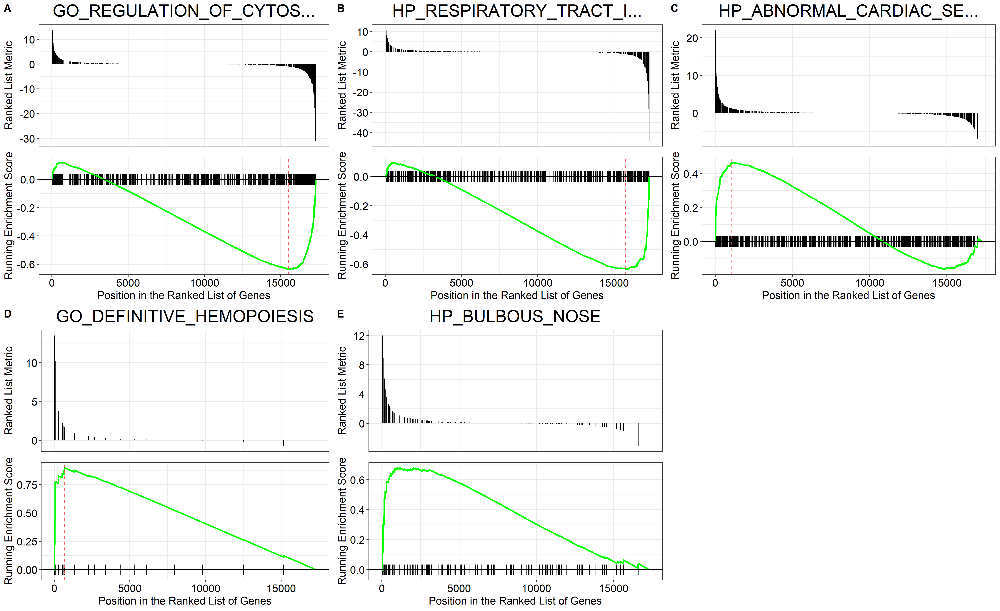
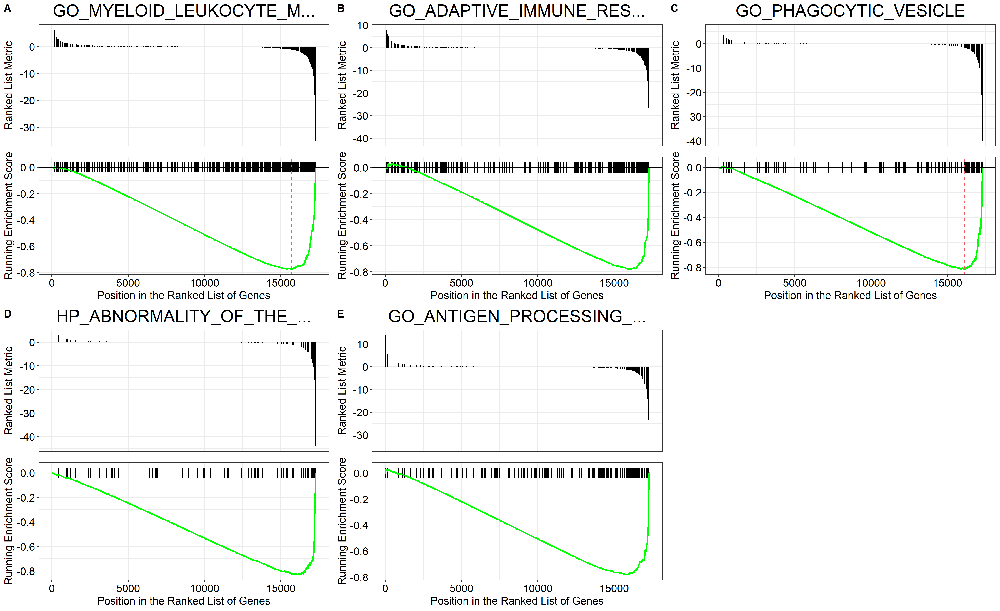

```{r setup, include=FALSE}
knitr::opts_chunk$set(echo = FALSE)
knitr::opts_chunk$set(message = FALSE)
knitr::opts_chunk$set(warning = FALSE)
```

```{r}
# Load libraries

suppressMessages(library(DESeq2))
suppressMessages(library(tidyverse))
suppressMessages(library(DT))
suppressMessages(library(AnnotationDbi))
suppressMessages(library(EnsDb.Hsapiens.v86))
suppressMessages(library(PoiClaClu))
suppressMessages(library(pheatmap))
suppressMessages(library(RColorBrewer))
suppressMessages(library(EnhancedVolcano))
suppressMessages(library(msigdbr))
suppressMessages(library(clusterProfiler))
suppressMessages(library(ggpubr))

```

## 0) Load and prepare data

### 0.1) Data overview

The data used in this RNA-Seq analysis was originally generated in [this study](https://www.ncbi.nlm.nih.gov/bioproject/PRJNA275655) ([SRA](https://www.ncbi.nlm.nih.gov/sra/?term=SRP055103)) and the results discussed in [this paper](https://doi.org/10.1016/j.stemcr.2015.04.012). The six generated runs can be found [here](https://www.ncbi.nlm.nih.gov/Traces/study/?acc=PRJNA275655&o=acc_s%3Aa).\

The biological question was to clarify the lineage relationship between IL3Rαhigh- and IL3Rαlow precursor cells and to find potential molecules involved in their differentiation. \

The utilized count matrix data was generated using [this](https://github.com/MaxGreil/rnaseq) nextflow RNA-Seq pipeline. The resulting output file <code>featureCounts_output.txt.gz</code> contains the input data for this RNA-Seq analysis.

```{r}
data <- read_delim("featureCounts_output.txt.gz", delim="\t", skip=1)
data <- as.data.frame(data)

rownames(data) <- data[, 1]
data <- data[, -1]
data <- data[, c(6:11)]

colnames(data) <- gsub("\\.sorted.bam$", "", colnames(data))

data <- data[, order(names(data))]

data <- as.matrix(data)
```

### 0.1) First look at data

First, the input data was cleaned. \

After this, the rownames contain the Ensembl version gene names. The six columns correspond to the gene counts for the six runs SRR1806626, SRR1806627, SRR1806628, SRR1806629, SRR1806630 and SRR1806631. \

The first three runs SRR1806626, SRR1806627 and SRR1806628 are generated from IL3Rαhigh precursor cells, runs SRR1806629, SRR1806630 and SRR1806631 are generated from IL3Rαlow precursor cells.

```{r}
datatable(head(data), options=list(scrollX = TRUE, scrollY = TRUE), caption = 'Table 1: First look at data', class = 'cell-border stripe')
```

## 1) Exploratory analyis and visualization

```{r}
condition <- factor(c("high", "high", "high", "low", "low", "low"), levels = c("high","low"))

coldata <- data.frame(row.names=colnames(data), condition)

## Create Large DESeqDataSet, using paired design
dds <- DESeqDataSetFromMatrix(countData=data, colData=coldata, design= ~ condition)
```

### 1.1) Create a PCA plot colored by the condition of interest

A variance-stabilizing transform was applied to the counts and a principal component analysis (PCA) was implemented to visualize sample-level differences.

```{r}
## Perform regularized-logarithm transformation (rlog) on the data
rld <- rlog(dds)

plotPCA(rld, intgroup = "condition")
```

### 1.2) Heatmap of Poisson distances between samples

To confirm the results of the PCA analysis, the sample-level distance was calculated via hierarchical clustering.

```{r, fig.height=7, fig.width=7.5}
poisd <- PoissonDistance(t(counts(dds)))
samplePoisDistMatrix <- as.matrix( poisd$dd )
rownames(samplePoisDistMatrix) <- colnames(dds)
colnames(samplePoisDistMatrix) <- colnames(dds)
colors <- colorRampPalette( rev(brewer.pal(9, "Blues")) )(255)
annotation <- as.data.frame(colData(rld)[, "condition"])
rownames(annotation) <- colnames(dds)
colnames(annotation) <- "condition"
pheatmap(samplePoisDistMatrix,
         clustering_distance_rows = poisd$dd,
         clustering_distance_cols = poisd$dd,
         annotation_row = annotation,
         col = colors,
         legend=FALSE,
         angle_col = 315)
```

## 2) Differential expression analysis

### 2.1) Calculation of DEGs using <code>DESeq2</code>

Differentially-expressed genes (DEGs) were calculated using the R package `DESeq2` with default settings. The used design matrix in this analysis was the comparison of the two levels of condition, high and low.\

Additionally, a shrinkage method was used on the raw data counts to shrink the log2 fold changes for the comparison of condition high vs low samples. The results of this analysis revealed 985 significant DEGs (see **Table 2**).\

A DEG was classified as significant when it showed an adjusted p-value smaller 0.01, a log2 fold change greater than or equal 1 and a base mean greater than or equal 20.

```{r}
# Differential expression analysis based on the Negative Binomial (a.k.a. Gamma-Poisson) distribution
dds <- DESeq(dds)

# Large DESeqResults
res <- results(dds) 

resNorm <- lfcShrink(dds = dds, res = res, type = "normal", coef = 2)

# Make a DF
resdf <- as.data.frame(resNorm)

# convert ENSG to gene symbol
ens2sym <- AnnotationDbi::select(EnsDb.Hsapiens.v86, keys = keys(EnsDb.Hsapiens.v86),
                                 columns = "SYMBOL")

# wrangle the resdf and join with ens2sym map
resdf <- resdf %>%
  rownames_to_column() %>%
  mutate(GENEID = gsub(rowname, pattern = "\\..+", replacement = "")) %>%
  inner_join(y = ens2sym, by = "GENEID")

resdf <- column_to_rownames(resdf, var = "rowname")

over_expressed_genes <- resdf %>%
  dplyr::filter(padj < .01 & abs(log2FoldChange) >= 1 & baseMean >= 20)

## Ordered DEGs from strongest downregulation to upregulation
datatable(as.data.frame(over_expressed_genes[order(over_expressed_genes$log2FoldChange),]), options=list(scrollX = TRUE, scrollY = TRUE), caption = 'Table 2: Significant DEGs', class = 'cell-border stripe')
```

## 3) Plotting results

### 3.1) MA plot

Relationship between intensity and difference between log fold change and mean of normalized counts for conditions high and low.

```{r}
plotMA(resNorm)
```

### 3.2) Create a Volcano Plot

The correlation of effect size (`Log2 fold change`) and significance (`-Log10P`) showed a number of significant DEGs (colored in red).

```{r, fig.height=8.5, fig.width=7.5}
EnhancedVolcano(resdf, 
                lab = resdf$SYMBOL, 
                pCutoff = 1e-30,
                FCcutoff = 3,
                x = "log2FoldChange", 
                y = "padj",
                title = "ILRa3-low versus ILRa3-high")
```

## 4) Heatmap showing the top 20 over- and under-expressed DEGs

The top 20 over- and under-expressed DEGs were identified based on their effect size (`Log2 fold change`). The 20 DEGs with the highest and the 20 DEGs with the lowest effect size were selected.

```{r, fig.height=8, fig.width=8}
# Prepare matrix for heatmap
mat <- assay(rld)
ordered_over_expressed_genes <- over_expressed_genes[order(over_expressed_genes$log2FoldChange), ]
id1 <- rownames(ordered_over_expressed_genes)
id2 <- ordered_over_expressed_genes$SYMBOL
DE <- mat[id1,]
rownames(DE) <- id2

# Plot heatmaps of top 20 over- and under-expressed DEGs
top20DE <- rbind(head(DE, n=20), tail(DE, n=20))
pheatmap(top20DE, 
          scale = "row",
          cutree_rows = 2,
          clustering_distance_rows = "correlation", 
          annotation_col = coldata, 
          main="Top 20 over- and under-expressed DEGs",
          legend=FALSE,
          angle_col = 315,
          cellheight=10)
```

## 5) Top 5 pathways of <code>GSEA</code> of DEGs

Gene set enrichment analysis (GSEA) was performed with `-log10(FDR)*sign(log2FoldChange)` as the ranking metric and using all available gene set annotations from MSIGDB.

```{r}
# Get the gene sets and wrangle
gene_sets <- msigdbr(species = "Homo sapiens", category = "C5")
gene_sets <- gene_sets %>%
  dplyr::select(gs_name, gene_symbol)

# Adding a score for GSEA
resdf2 <- resdf %>%
  arrange(padj) %>%
  # Deal with inf
  mutate(padj = case_when(padj == 0 ~ .Machine$double.xmin, TRUE ~ padj)) %>%
  mutate(gsea_metric = -log10(padj) * sign(log2FoldChange)) %>%
  # Remove NAs and order by GSEA
  dplyr::filter(! is.na(gsea_metric)) %>%
  arrange(desc(gsea_metric))

# Get the ranked GSEA vector
ranks <- resdf2 %>%
  dplyr::select(SYMBOL, gsea_metric) %>%
  distinct(SYMBOL, .keep_all = TRUE) %>%
  deframe()
```

The histogram below shows the calculated GSEA metric for this analyzed data.

```{r}
# GSEA value histogram
hist(resdf2$gsea_metric, breaks = 100, xlab = "Calculated GSEA metric", main = "Histogram of GSEA metric")
```

```{r}
# Ensure a deterministic result for GSEA
set.seed(5)

# Run GSEA
gseares <- GSEA(geneList = ranks, 
                TERM2GENE = gene_sets)
gsearesdf <- as.data.frame(gseares)

# Get top 5 over-expressed pathways
top_pathways <- gsearesdf %>%
  top_n(n = 5, wt = NES) %>%
  arrange(NES)

# Repeat steps with top 5 under-expressed pathways
bottom_pathways <- gsearesdf %>%
  top_n(n = 5, wt = -NES) %>%
  arrange(NES)
```

A barplot was created to show the identified top 5 under- and over-expressed pathways based on their calculated normalized enrichment score (NES) by GSEA.

```{r}
# Create barplot of top 5 under - and over-expressed pathways
sig_pathways = rbind(bottom_pathways, top_pathways)

sig_pathways$ID <- factor(sig_pathways$ID, levels = sig_pathways$ID[order(sig_pathways$NES, decreasing = TRUE)])

ggplot(sig_pathways, aes(x=ID, y=NES)) + 
  geom_bar(stat = "identity") +
  ggtitle("Top 5 pathways") +
  theme(plot.title = element_text(hjust = 0.5)) +
  xlab("") +
  ylab("Normalized Enrichment Score") +
  coord_flip()
```

### 5.1) Top 5 over-expressed pathways

The plot below shows the top 5 over-expressed pathways for our GSEA.\

How to interpret these plots?\

The x-axis is dependent on and represents the input list of ranked genes, i.e. the identified significant DEGs ranked by their calculated GSEA metric. The black vertical bars along the x-axis are those genes from the input list that feature in the gene-set / signature that is being enriched. The green line is the enrichment of this gene-set / signature. The enrichment can be positive or negative.

```{r}
# Get IDs for top 5 over-expressed pathways
top_pathways <- top_pathways %>%
  pull(ID)

# Make gseaplot for each and return as list
top_pathway_plots <- lapply(top_pathways, function(pathway) {
  pathway_short <- pathway %>% 
    str_trunc(25)
  gseaplot(gseares, geneSetID = pathway, title = pathway_short)
})

# Arrange with labels as a multi-panel plot
top_pathway_plot <- ggarrange(plotlist = top_pathway_plots,
                              ncol = 3, nrow = 2, labels = "AUTO")

ggsave(top_pathway_plot, filename = "top_GSEA_up.png",
       height = 11, width = 18)
```

```{r out.width='100%'}

```

### 5.2) Top 5 under-expressed pathways

The plot below shows the top 5 under-expressed pathways for our GSEA.

```{r}
# Repeat steps with top 5 under-expressed pathways
bottom_pathways <- bottom_pathways %>%
  pull(ID)

bottom_pathway_plots <- lapply(bottom_pathways, function(pathway) {
  pathway_short <- pathway %>% 
    str_trunc(25)
  gseaplot(gseares, geneSetID = pathway, title = pathway_short)
})

bottom_pathway_plot <- ggarrange(plotlist = bottom_pathway_plots,
                                 ncol = 3, nrow = 2, labels = "AUTO")

ggsave(bottom_pathway_plot, filename = "top_GSEA_down.png",
       height = 11, width = 18)
```

```{r out.width='100%'}

```

### 5.3) Table of all significant pathways

137 significant results for the conducted GSEA were found based on an adjusted p-value smaller than or equal to 0.05 (see **Table 3**).

```{r}
sig_gsearesdf <- gsearesdf %>%
  filter(p.adjust <= 0.05) %>%
  arrange(desc(NES)) %>%
  select(NES, pvalue, p.adjust, core_enrichment)

datatable(sig_gsearesdf, options=list(scrollX = TRUE, scrollY = TRUE), caption = 'Table 3: Significant GSEA', class = 'cell-border stripe')
```


